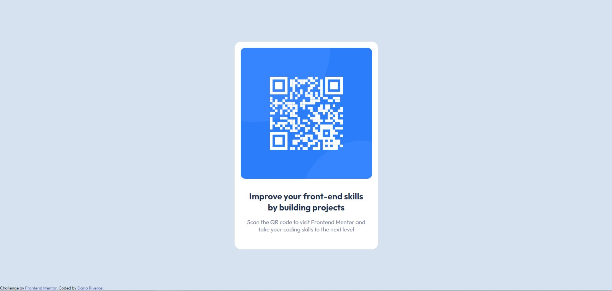

# Frontend Mentor - QR code component solution

This is a solution to the [QR code component challenge on Frontend Mentor](https://www.frontendmentor.io/challenges/qr-code-component-iux_sIO_H). Frontend Mentor challenges help you improve your coding skills by building realistic projects. 

## Table of contents

 - [Screenshot](#screenshot)
  - [Links](#links)
  - [Built with](#built-with)
- [Author](#author)

### Screenshot

### Links

- Solution URL: [https://github.com/darioriverosp/qr-code-component-main](https://github.com/darioriverosp/qr-code-component-main)
- Live Site URL: [Add live site URL here](https://your-live-site-url.com)

### Built with

- Semantic HTML5 markup
- CSS custom properties
- Flexbox
- CSS Grid
- Mobile-first workflow

## Author

- Website - [Darioriverosp](https://www.darioriverosp.xyz)
- Frontend Mentor - [@darioriverosp](https://www.frontendmentor.io/profile/darioriverosp)
- Twitter - [@darioriverosp](https://www.twitter.com/darioriverosp)